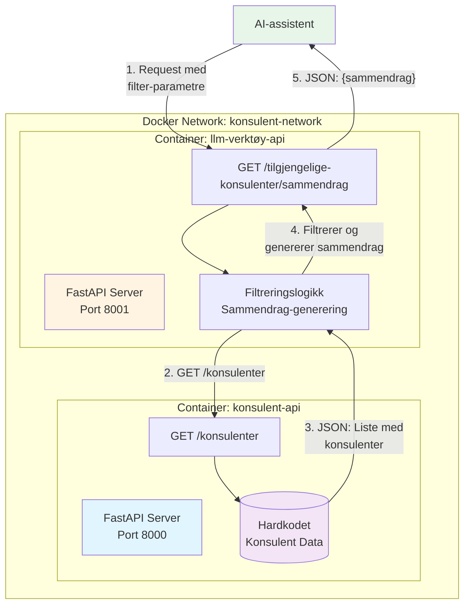
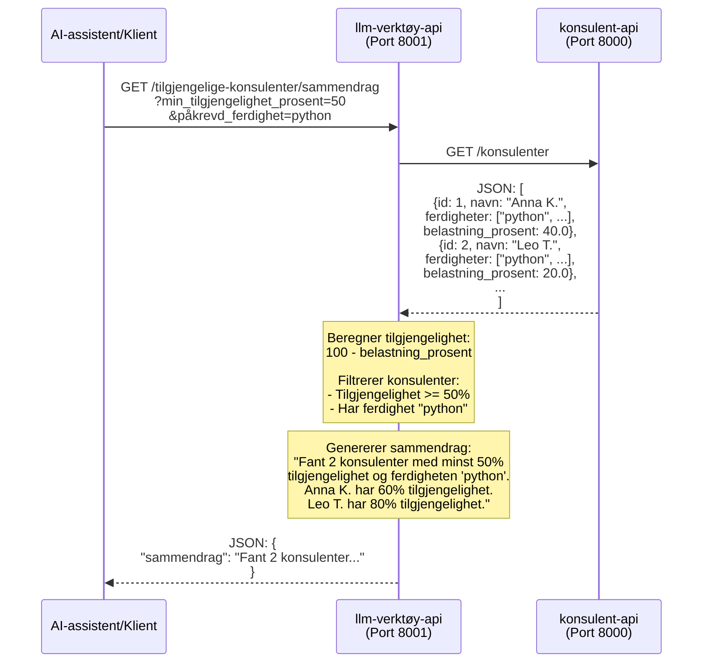

# Konsulent-Staffing API (MCP-inspirert løsning)

Dette er en løsning for konsulent-staffing som består av to mikrotjenester bygget med Python og FastAPI. Løsningen er designet for å kunne brukes av AI-assistenter, og er implementert som REST API (se [MCP vs REST API](#mcp-model-context-protocol-vs-rest-api) for begrunnelse).

## Arkitektur

Løsningen består av to mikrotjenester:

1. **konsulent-api** (Port 8000): Server som eksponerer konsulentdata
   - Endepunkt: `GET /konsulenter` - Returnerer hardkodet liste med konsulenter

2. **llm-verktøy-api** (Port 8001): Klient som filtrerer og sammendragstiller konsulenter ved hjelp av LLM
   - Endepunkt: `GET /tilgjengelige-konsulenter/sammendrag` - Returnerer LLM-generert menneskeleselig sammendrag
   - Bruker OpenRouter API for å generere sammendrag med AI-modell

### Systemdiagram



### Dataflyt



## Krav

- Docker
- Docker Compose

## Installasjon og kjøring

1. Klon repositoryet (eller naviger til prosjektmappen)

2. Bygg og start tjenestene:
```bash
docker compose up --build
```

3. Tjenestene er nå tilgjengelige:
   - konsulent-api: http://localhost:8000
   - llm-verktøy-api: http://localhost:8001

## API Dokumentasjon

### konsulent-api

#### GET /konsulenter
Returnerer liste over alle konsulenter.

**Eksempel respons:**
```json
[
  {
    "id": 1,
    "navn": "Anna K.",
    "ferdigheter": ["python", "fastapi", "docker"],
    "belastning_prosent": 40.0
  },
  ...
]
```

**Swagger UI:** http://localhost:8000/docs

### llm-verktøy-api

#### GET /tilgjengelige-konsulenter/sammendrag
Henter og filtrerer konsulenter basert på tilgjengelighet og ferdighet, returnerer menneskeleselig sammendrag.

**Query parametre:**
- `min_tilgjengelighet_prosent` (required): Minimum tilgjengelighet i prosent
- `påkrevd_ferdighet` (required): Påkrevd ferdighet

**Eksempel request:**
```
GET http://localhost:8001/tilgjengelige-konsulenter/sammendrag?min_tilgjengelighet_prosent=50&påkrevd_ferdighet=python
```

**Eksempel respons:**
```json
{
  "sammendrag": "Fant 2 konsulenter med minst 50% tilgjengelighet og ferdigheten 'python'. Anna K. har 60% tilgjengelighet. Leo T. har 80% tilgjengelighet."
}
```

**Swagger UI:** http://localhost:8001/docs

## MCP (Model Context Protocol) vs REST API

### Valg av REST API

Løsningen er implementert som **REST API** i stedet for full MCP-protokoll, av følgende grunner:

1. **Oppgavens spesifikasjon**: Oppgaven spesifiserte konkrete REST-endepunkter (`GET /konsulenter`, `GET /tilgjengelige-konsulenter/sammendrag`), noe som tyder på at REST API var den ønskede tilnærmingen.

2. **Enkelhet og klarhet**: REST API er mer direkte for denne brukssaken, med tydelige HTTP-endepunkter som er enkle å teste og dokumentere.

3. **Kompatibilitet**: REST API kan enkelt konsumeres av både tradisjonelle klienter og AI-assistenter via HTTP-kall.

### Hva ville vært nødvendig for ekte MCP-implementering?

For en fullstendig MCP-server ville vi trengt:

- **FastMCP eller MCP SDK**: Bibliotek for å implementere MCP-protokollen
- **Tool-definisjoner**: Verktøy definert med `@mcp.tool()` dekoratører
- **Schema discovery**: Automatisk oppdagelse av tilgjengelige verktøy
- **Streamable HTTP transport**: MCP krever spesifikk transport-lag
- **Autentisering**: Bearer tokens eller JWT for sikkerhet

**Eksempel på MCP-implementering:**
```python
from fastapi import FastAPI
from mcp.server.fastmcp import FastMCP

app = FastAPI()
mcp = FastMCP(name="Konsulent Staffing MCP")

@mcp.tool()
async def hent_tilgjengelige_konsulenter(
    min_tilgjengelighet: float,
    påkrevd_ferdighet: str
) -> dict:
    """Hent tilgjengelige konsulenter basert på kriterier."""
    # Implementasjon...
    return {"sammendrag": "..."}

app.mount("/mcp", mcp.streamable_http_app())
```


## LLM og Modellvalg

Løsningen bruker **OpenRouter API** for å generere menneskeleselige sammendrag via en AI-modell.

### Valgt Modell: `openai/gpt-3.5-turbo`

**Begrunnelse for modellvalg:**

1. **Kostnadseffektivitet**: GPT-3.5-turbo er en av de mest kostnadseffektive modellene på OpenRouter, viktig med tanke på $5 credit limit.

2. **Hastighet**: Modellen har lav latency, viktig for API-responser.

3. **Kvalitet**: GPT-3.5-turbo leverer gode resultater for tekstgenerering på norsk, som er tilstrekkelig for å generere profesjonelle sammendrag.

4. **Konsistens**: Med `temperature=0.3` sikrer vi mer konsistente og forutsigbare resultater.

5. **Kompatibilitet**: OpenRouter er kompatibel med OpenAI API, noe som gjør integrasjonen enkel.

**Alternativer vurdert:**
- `anthropic/claude-3-haiku`: Raskere, men høyere kostnad
- `meta-llama/llama-3.2-3b-instruct`: Gratis, men lavere kvalitet på norsk
- `openai/gpt-4`: Høyere kvalitet, men for dyr for denne brukssaken

**Fallback-mekanisme**: Hvis OpenRouter API ikke er tilgjengelig eller feiler, faller løsningen tilbake til en enkel tekst-generering uten LLM.

## Testing

### Test konsulent-api direkte:
```bash
curl http://localhost:8000/konsulenter
```

### Test llm-verktøy-api:
```bash
curl "http://localhost:8001/tilgjengelige-konsulenter/sammendrag?min_tilgjengelighet_prosent=50&påkrevd_ferdighet=python"
```

## Struktur

```
.
├── konsulent-api/
│   ├── main.py
│   ├── requirements.txt
│   └── Dockerfile
├── llm-verktøy-api/
│   ├── main.py
│   ├── requirements.txt
│   └── Dockerfile
├── docker-compose.yml
└── README.md
```

## Stoppe tjenestene

```bash
docker compose down
```

## Logging

Loggene fra begge tjenestene kan sees i terminalen når du kjører `docker compose up`, eller via:

```bash
docker compose logs -f
```

## Health Checks

Begge tjenestene har health check endepunkter:
- konsulent-api: http://localhost:8000/health
- llm-verktøy-api: http://localhost:8001/health

