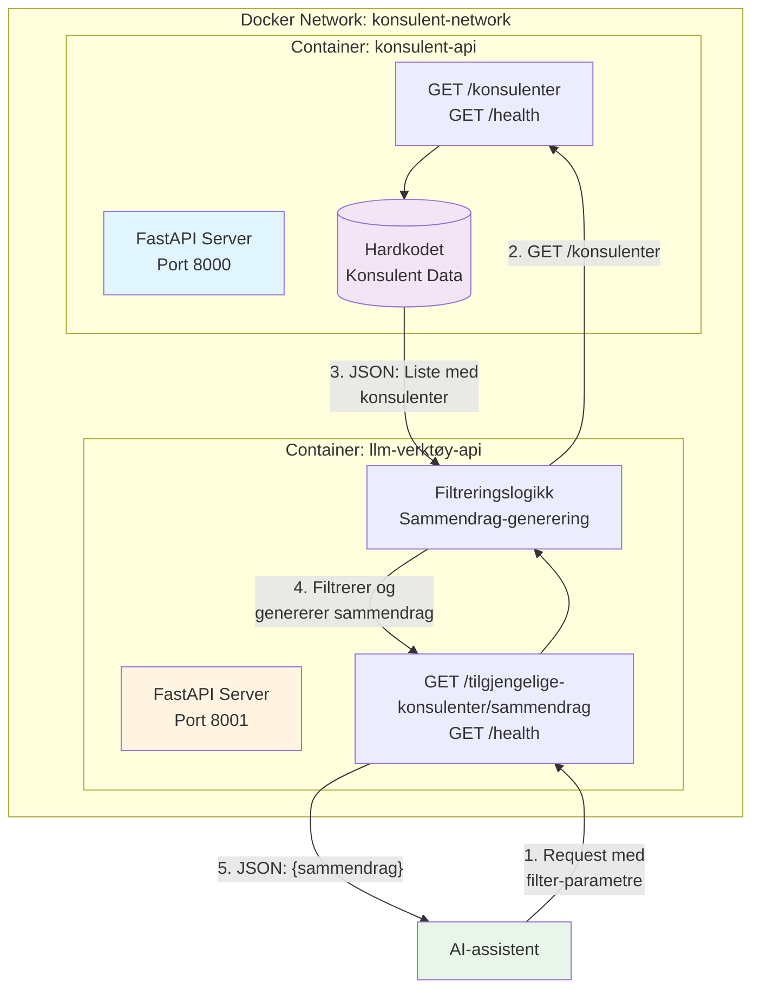
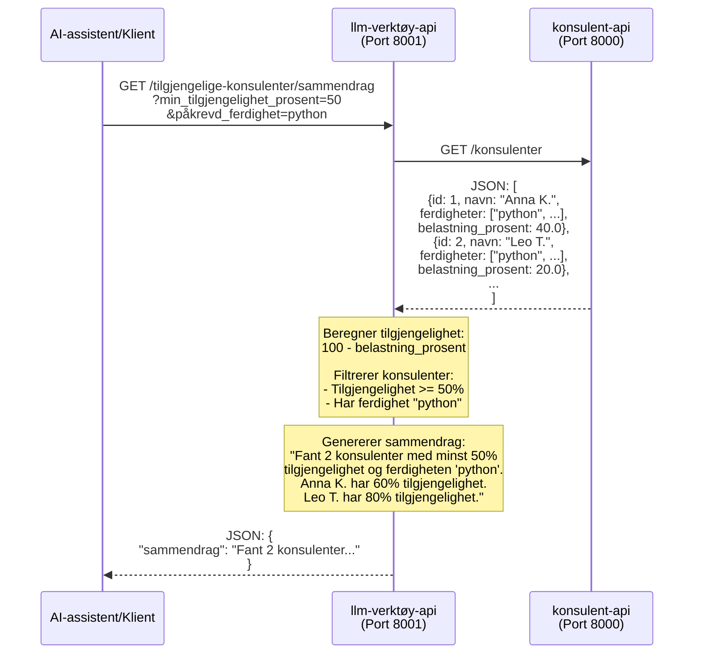

# MCP Løsning for Konsulent-Staffing

Dette er en MCP-basert løsning for konsulent-staffing som består av to mikrotjenester bygget med Python og FastAPI.

## Arkitektur

Løsningen består av to mikrotjenester:

1. **konsulent-api** (Port 8000): Server som eksponerer konsulentdata
   - Endepunkt: `GET /konsulenter` - Returnerer hardkodet liste med konsulenter

2. **llm-verktøy-api** (Port 8001): Klient som filtrerer og sammendragstiller konsulenter
   - Endepunkt: `GET /tilgjengelige-konsulenter/sammendrag` - Returnerer menneskeleselig sammendrag

### Systemdiagram



### Dataflyt



## Krav

- Docker
- Docker Compose

## Installasjon og kjøring

1. Klon repositoryet (eller naviger til prosjektmappen)

2. Bygg og start tjenestene:
```bash
docker compose up --build
```

3. Tjenestene er nå tilgjengelige:
   - konsulent-api: http://localhost:8000
   - llm-verktøy-api: http://localhost:8001

## API Dokumentasjon

### konsulent-api

#### GET /konsulenter
Returnerer liste over alle konsulenter.

**Eksempel respons:**
```json
[
  {
    "id": 1,
    "navn": "Anna K.",
    "ferdigheter": ["python", "fastapi", "docker"],
    "belastning_prosent": 40.0
  },
  ...
]
```

**Swagger UI:** http://localhost:8000/docs

### llm-verktøy-api

#### GET /tilgjengelige-konsulenter/sammendrag
Henter og filtrerer konsulenter basert på tilgjengelighet og ferdighet, returnerer menneskeleselig sammendrag.

**Query parametre:**
- `min_tilgjengelighet_prosent` (required): Minimum tilgjengelighet i prosent
- `påkrevd_ferdighet` (required): Påkrevd ferdighet

**Eksempel request:**
```
GET http://localhost:8001/tilgjengelige-konsulenter/sammendrag?min_tilgjengelighet_prosent=50&påkrevd_ferdighet=python
```

**Eksempel respons:**
```json
{
  "sammendrag": "Fant 2 konsulenter med minst 50% tilgjengelighet og ferdigheten 'python'. Anna K. har 60% tilgjengelighet. Leo T. har 80% tilgjengelighet."
}
```

**Swagger UI:** http://localhost:8001/docs

## Testing

### Test konsulent-api direkte:
```bash
curl http://localhost:8000/konsulenter
```

### Test llm-verktøy-api:
```bash
curl "http://localhost:8001/tilgjengelige-konsulenter/sammendrag?min_tilgjengelighet_prosent=50&påkrevd_ferdighet=python"
```

## Struktur

```
.
├── konsulent-api/
│   ├── main.py
│   ├── requirements.txt
│   └── Dockerfile
├── llm-verktøy-api/
│   ├── main.py
│   ├── requirements.txt
│   └── Dockerfile
├── docker-compose.yml
└── README.md
```

## Stoppe tjenestene

```bash
docker compose down
```

## Logging

Loggene fra begge tjenestene kan sees i terminalen når du kjører `docker compose up`, eller via:

```bash
docker compose logs -f
```

## Health Checks

Begge tjenestene har health check endepunkter:
- konsulent-api: http://localhost:8000/health
- llm-verktøy-api: http://localhost:8001/health

